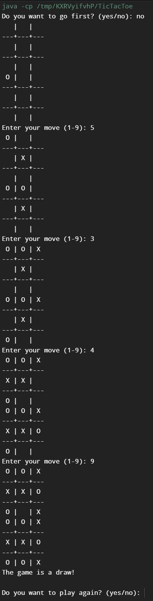
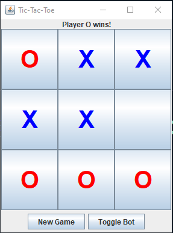
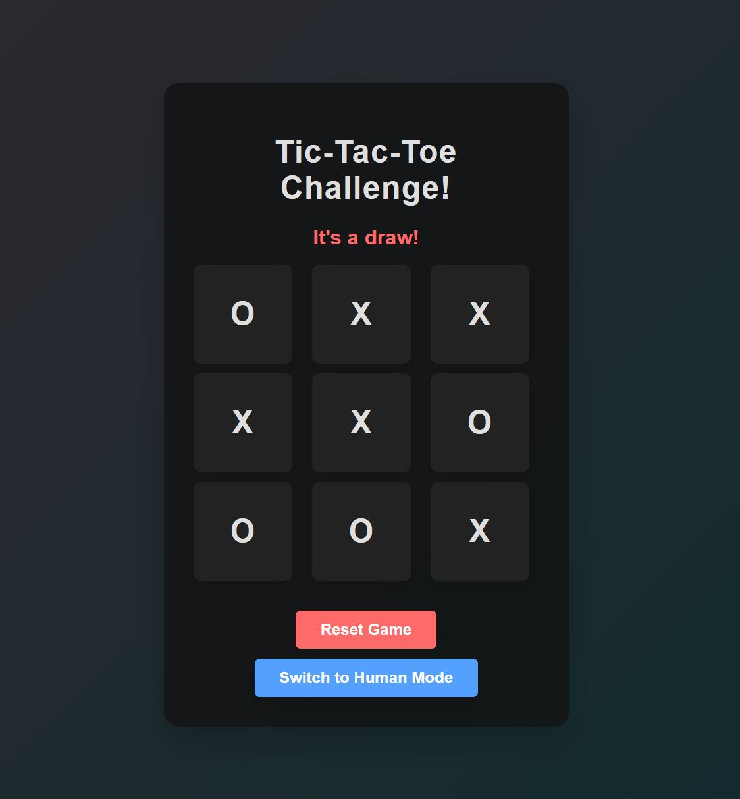

# TicTacToe-Challenge

Welcome to the TicTacToe-Challenge repository! This project showcases Tic-Tac-Toe implementations in Java and HTML/CSS/JS, featuring both human vs. human and human vs. AI gameplay.

## Features

- **Java Implementation**: A console-based Tic-Tac-Toe game with AI opponent.
- **Java UI Implementation**: A graphical Tic-Tac-Toe game with a user-friendly interface and AI opponent.
- **HTML/CSS/JS Implementation**: A web-based Tic-Tac-Toe game with an interesting UI and AI opponent.

## Screenshots

### Java Game



### Java UI Game



### Web Game



## Getting Started

### Java Implementation

1. Clone the repository:
   ```sh
    git clone https://github.com/yourusername/TicTacToeShowcase.git
2. Navigate to the Java directory:
   ```sh
    cd TicTacToeShowcase/java
3. Compile and run the Java program:
   ```sh
    javac TicTacToe.java
    java TicTacToe
<br>

### HTML/CSS/JS Implementation

1. Clone the repository:
   ```sh
    git clone https://github.com/yourusername/TicTacToeShowcase.git
2. Open the `.html` file in your web browser.
<br>

### Java UI Implementation

1. Clone the repository:
   ```sh
   git clone https://github.com/yourusername/TicTacToe-Challenge.git
2. Navigate to the Java directory:
   ```sh
   cd TicTacToe-Challenge/java
3. Compile and run the Java program:
   ```sh
   javac TicTacToeUI.java
   java TicTacToeUI

## Contributing

Pull requests are welcome. For major changes, please open an issue first to discuss what you would like to change.

## File Structure

- `snapshots/`: Contains screenshots of the implementations.
- `.gitignore`: Specifies files and directories to ignore in the repository.
- `LICENSE`: The license for the project.
- `README.md`: This file.
- `TicTacToe.html`: The HTML file for the web-based implementation.
- `TicTacToe-Console.java`: The Java file for the console-based implementation.
- `TicTacToe-UI.java`: The Java file for the UI-based implementation.
