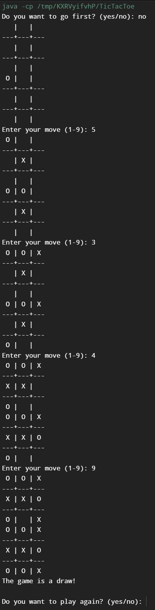
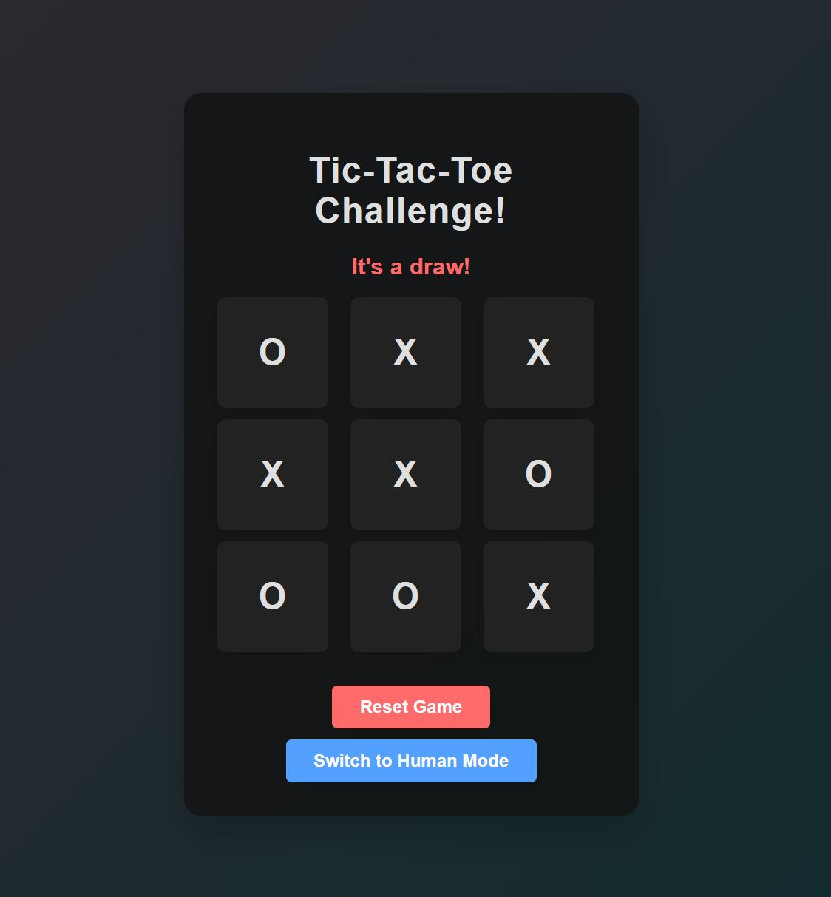

# Tic-Tac-Toe Challenge

Welcome to the TicTacToeShowcase repository! This project showcases Tic-Tac-Toe implementations in Java and HTML/CSS/JS, featuring both human vs. human and human vs. AI gameplay.

## Features
- **Java Implementation**: A console-based Tic-Tac-Toe game with AI opponent.
- **HTML/CSS/JS Implementation**: A web-based Tic-Tac-Toe game with an attractive UI and AI opponent.

## Screenshots




## Getting Started

### Java Implementation

1. Clone the repository:
   ```sh
    git clone https://github.com/yourusername/TicTacToeShowcase.git
2. Navigate to the Java directory:
   ```sh
    cd TicTacToeShowcase/java
3. Compile and run the Java program:
   ```sh
    javac TicTacToe.java
    java TicTacToe

### HTML/CSS/JS Implementation

1. Clone the repository:
   ```sh
    git clone https://github.com/yourusername/TicTacToeShowcase.git
2. Open the index.html file in your web browser.

### Contributing

Pull requests are welcome. For major changes, please open an issue first to discuss what you would like to change.
